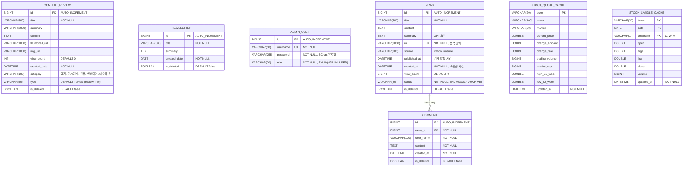

# Finance DWpj1 ERD (Entity Relationship Diagram)

> 프로젝트: finance_DWpj1
> 생성일: 2025-11-25
> 데이터베이스 스키마 문서

---

## 📊 ERD Diagram (Mermaid)



---

## 📋 테이블 목록

### Content 도메인
- **CONTENT_REVIEW**: 콘텐츠 리뷰/게시글
- **NEWSLETTER**: 주기 발행 뉴스레터

### Insights 도메인
- **ADMIN_USER**: 관리자 계정
- **NEWS**: 뉴스 기사 (Yahoo Finance 크롤링)
- **COMMENT**: 뉴스 댓글

### Stock 도메인
- **STOCK_QUOTE_CACHE**: 주식 시세 캐시
- **STOCK_CANDLE_CACHE**: 주식 캔들(OHLCV) 캐시

---

## 🔗 관계 (Relationships)

### NEWS ↔ COMMENT (1:N)
```
NEWS (1) ──── (N) COMMENT
```
- 하나의 뉴스는 여러 댓글을 가질 수 있음
- **외래키**: `COMMENT.news_id` → `NEWS.id`
- **Fetch 전략**: LAZY (지연 로딩)

---

## 📌 주요 특징

### 1. 소프트 삭제 (Soft Delete)
모든 주요 엔티티는 `is_deleted` 플래그 사용
- CONTENT_REVIEW
- NEWSLETTER
- NEWS
- COMMENT

### 2. 캐시 전략
Stock 도메인은 외부 API 호출 최소화를 위해 캐시 테이블 사용
- **STOCK_QUOTE_CACHE**: 실시간 시세 정보
- **STOCK_CANDLE_CACHE**: 차트 데이터 (OHLCV)

### 3. Enum 타입

**AdminUser.Role**:
- `ADMIN`: 관리자
- `USER`: 일반 사용자

**News.NewsStatus**:
- `DAILY`: 24시간 이내 뉴스
- `ARCHIVE`: 24시간 이상 경과 뉴스

**ContentReview.type**:
- `review`: 리뷰 게시글
- `info`: 정보 게시글

**StockCandleCache.timeframe**:
- `D`: 일봉 (Daily)
- `W`: 주봉 (Weekly)
- `M`: 월봉 (Monthly)

---

## 🎯 도메인별 역할

| 도메인 | 패키지 | 역할 |
|--------|--------|------|
| **Content** | `entity.content` | 콘텐츠 리뷰 및 뉴스레터 관리 |
| **Insights** | `entity.insights` | 뉴스 크롤링 및 댓글 시스템 |
| **Stock** | `entity.stock` | 주식 시세 및 차트 데이터 캐싱 |

---

*이 문서는 코드 기반 자동 생성되었습니다.*