# Finance DWpj1 ERD (Entity Relationship Diagram)

> 프로젝트: finance_DWpj1
> 최종 업데이트: 2025-12-19
> 전체 엔티티 수: 22개
> 데이터베이스 스키마 문서

---

## 📊 ERD Diagram (Mermaid)

```mermaid
erDiagram
    %% ========================================
    %% USER 도메인
    %% ========================================
    USERS {
        BIGINT id PK "AUTO_INCREMENT"
        VARCHAR(100) email UK "NOT NULL, 로그인 아이디"
        VARCHAR(30) nickname UK "NOT NULL, 화면 표시용"
        VARCHAR(255) password "NOT NULL, BCrypt 암호화"
        VARCHAR(20) phone_number
        DATETIME created_at "NOT NULL, 가입일"
        BOOLEAN is_active "NOT NULL, DEFAULT true"
        VARCHAR(20) role "NOT NULL, ENUM(USER, ADMIN)"
        VARCHAR(50) grade
    }

    %% ========================================
    %% STOCK 도메인
    %% ========================================
    STOCK_BOARD {
        BIGINT id PK "AUTO_INCREMENT"
        VARCHAR(50) ticker "NOT NULL, 종목 티커"
        VARCHAR(200) title "NOT NULL"
        TEXT content "NOT NULL"
        VARCHAR(50) writer "NOT NULL"
        DATETIME reg_date "NOT NULL"
        DATETIME mod_date
        INT recommend "DEFAULT 0"
        INT unrecommend "DEFAULT 0"
        INT view "DEFAULT 0"
    }

    STOCK_BOARD_COMMENT {
        BIGINT id PK "AUTO_INCREMENT"
        BIGINT board_id FK "NOT NULL"
        TEXT content "NOT NULL"
        VARCHAR(50) writer "NOT NULL"
        DATETIME reg_date "NOT NULL"
        DATETIME mod_date
    }

    STOCK_BOARD_IMAGE {
        BIGINT id PK "AUTO_INCREMENT"
        BIGINT board_id FK "NOT NULL"
        VARCHAR file_name
        VARCHAR file_path
    }

    STOCK_BOARD_GECHU {
        BIGINT id PK "AUTO_INCREMENT"
        BIGINT board_id FK "NOT NULL"
        BIGINT user_id "NOT NULL"
    }

    STOCK_BOARD_BICHU {
        BIGINT id PK "AUTO_INCREMENT"
        BIGINT board_id FK "NOT NULL"
        BIGINT user_id "NOT NULL"
    }

    STOCK_QUOTE_CACHE {
        VARCHAR(20) ticker PK
        VARCHAR(100) name
        VARCHAR(20) market
        DOUBLE current_price
        DOUBLE change_amount
        DOUBLE change_rate
        BIGINT trading_volume
        BIGINT market_cap
        DOUBLE high_52_week
        DOUBLE low_52_week
        DATETIME updated_at "NOT NULL"
    }

    STOCK_CANDLE_CACHE {
        VARCHAR(20) ticker PK
        DATE date PK
        VARCHAR(1) timeframe PK "D, W, M"
        DOUBLE open
        DOUBLE high
        DOUBLE low
        DOUBLE close
        BIGINT volume
        DATETIME updated_at "NOT NULL"
    }

    %% ========================================
    %% CONTENT 도메인
    %% ========================================
    CONTENT_REVIEW {
        BIGINT id PK "AUTO_INCREMENT"
        VARCHAR(500) title "NOT NULL"
        VARCHAR thumbnail
        TEXT content
        VARCHAR(1000) img_url
        VARCHAR(2000) hashtags
        BIGINT user_id
        VARCHAR(30) writer
        INT view_count "DEFAULT 0"
        VARCHAR(7) view_month
        INT view_count_month "DEFAULT 0"
        DATETIME created_date "NOT NULL"
        VARCHAR(50) type "DEFAULT 'review'"
        BOOLEAN is_deleted "DEFAULT false"
        DATETIME deleted_at
        VARCHAR(100) deleted_by
        TEXT delete_reason
    }

    CONTENT_COMMENT {
        BIGINT id PK "AUTO_INCREMENT"
        BIGINT post_id "게시글 ID"
        BIGINT user_id
        VARCHAR writer
        VARCHAR content
        DOUBLE rating "0.0 ~ 5.0"
        BIGINT parent_comment_id FK "답글용 부모 댓글"
        DATETIME created_date "NOT NULL"
    }

    INFO_POST {
        BIGINT id PK "AUTO_INCREMENT"
        VARCHAR(100) title "NOT NULL"
        VARCHAR(255) thumbnail_url
        VARCHAR(50) writer "NOT NULL"
        BOOLEAN is_deleted "NOT NULL, DEFAULT false"
        DATETIME created_date "NOT NULL"
        DATETIME updated_date "NOT NULL"
        DATETIME deleted_date
        VARCHAR(50) deleted_by
    }

    CONTENT_INFO_SECTION {
        BIGINT id PK "AUTO_INCREMENT"
        BIGINT info_post_id FK "NOT NULL"
        VARCHAR(50) section_type "NOT NULL, PROFILE/CHANNEL/ACTIVITY/WHY"
        VARCHAR(100) title "NOT NULL"
        TEXT content
        VARCHAR(255) thumbnail_url
        INT display_order "NOT NULL, DEFAULT 999"
    }

    %% ========================================
    %% INSIGHTS 도메인
    %% ========================================
    NEWS {
        BIGINT id PK "AUTO_INCREMENT"
        VARCHAR(500) title "NOT NULL"
        TEXT content "한국어 번역"
        TEXT original_content "영어 원문"
        TEXT summary "GPT 요약"
        VARCHAR(1000) url UK "NOT NULL"
        VARCHAR(100) source "Yahoo Finance"
        DATETIME published_at
        DATETIME created_at "NOT NULL"
        BIGINT view_count "DEFAULT 0"
        VARCHAR(20) status "ENUM(DAILY, ARCHIVE)"
        BOOLEAN is_deleted "DEFAULT false"
        DATETIME deleted_at
        VARCHAR(100) deleted_by
        TEXT delete_reason
    }

    COMMENT {
        BIGINT id PK "AUTO_INCREMENT"
        BIGINT news_id FK "NOT NULL"
        BIGINT parent_comment_id FK "답글용"
        VARCHAR(100) user_name "NOT NULL"
        TEXT content "NOT NULL"
        INT like_count "DEFAULT 0"
        INT dislike_count "DEFAULT 0"
        DATETIME created_at "NOT NULL"
        BOOLEAN is_deleted "DEFAULT false"
    }

    ADMIN_USER {
        BIGINT id PK "AUTO_INCREMENT"
        VARCHAR(50) username UK "NOT NULL"
        VARCHAR(255) password "NOT NULL, BCrypt"
        VARCHAR(20) role "ENUM(ADMIN, USER)"
    }

    INVESTOR_INSIGHT {
        BIGINT id PK "AUTO_INCREMENT"
        VARCHAR(50) investor_id UK "NOT NULL, buffett/wood 등"
        VARCHAR(100) name "NOT NULL"
        TEXT philosophy_ko "NOT NULL"
        VARCHAR(100) investment_style
        VARCHAR(500) profile_image_url
        DATETIME created_at "NOT NULL"
        DATETIME updated_at "NOT NULL"
        VARCHAR(100) modified_by
    }

    TWITTER_INSIGHTS {
        BIGINT id PK "AUTO_INCREMENT"
        VARCHAR(100) name "NOT NULL"
        VARCHAR(50) handle "NOT NULL, @username"
        VARCHAR(500) avatar
        BOOLEAN verified "DEFAULT false"
        TEXT original_text "NOT NULL"
        TEXT translated_text
        VARCHAR(50) tweet_date
        VARCHAR(500) url
        VARCHAR(20) source "ENUM(DUMMY, MANUAL, API)"
        DATETIME created_at "NOT NULL"
        BOOLEAN is_deleted "DEFAULT false"
    }

    %% ========================================
    %% PORTFOLIO 도메인
    %% ========================================
    INVESTOR_PROFILES {
        VARCHAR(50) investor_id PK "buffett, wood, dalio"
        VARCHAR(100) name "NOT NULL"
        VARCHAR(100) name_en "NOT NULL"
        VARCHAR(50) organization "NOT NULL"
        VARCHAR(20) cik "NOT NULL, SEC CIK"
        TEXT philosophy
        TEXT strengths
        TEXT weaknesses
        VARCHAR(50) investment_style
        VARCHAR(500) profile_image_url
        BOOLEAN active "DEFAULT true"
    }

    INVESTOR_13F_HOLDINGS {
        BIGINT id PK "AUTO_INCREMENT"
        VARCHAR(50) investor_id "NOT NULL"
        VARCHAR(10) ticker "NOT NULL"
        VARCHAR(200) company_name
        BIGINT shares "NOT NULL"
        DOUBLE market_value "NOT NULL"
        DOUBLE portfolio_weight "NOT NULL"
        VARCHAR(7) filing_quarter "NOT NULL, 2024Q1"
        DATE filing_date "NOT NULL"
        VARCHAR(500) sec_filing_url
    }

    SEC_COLLECTOR_CHECKPOINT {
        BIGINT id PK "AUTO_INCREMENT"
        VARCHAR(50) investor_id "NOT NULL"
        VARCHAR(10) filing_quarter "NOT NULL"
        VARCHAR(20) status "ENUM(PENDING, IN_PROGRESS, SUCCESS, FAILED, SKIPPED)"
        DATETIME started_at
        DATETIME completed_at
        TEXT fail_reason
        INT retry_count "DEFAULT 0"
        INT holdings_count
    }

    %% ========================================
    %% NOTIFICATION 도메인
    %% ========================================
    NOTIFICATION {
        BIGINT id PK "AUTO_INCREMENT"
        BIGINT receiver_id "NOT NULL"
        VARCHAR(20) type "ENUM(COMMENT, TAG, NOTICE)"
        VARCHAR(200) message "NOT NULL"
        VARCHAR(300) target_url "NOT NULL"
        BOOLEAN is_read "NOT NULL"
        DATETIME created_date "NOT NULL"
    }

    %% ========================================
    %% AUDIT 도메인
    %% ========================================
    AUDIT_DELETE_LOG {
        BIGINT id PK "AUTO_INCREMENT"
        VARCHAR(20) action "ENUM(SOFT_DELETE, HARD_DELETE)"
        VARCHAR(50) target_type "ENUM(NEWS, CONTENT_REVIEW)"
        BIGINT target_id "NOT NULL"
        VARCHAR(500) target_title
        BIGINT actor_user_id
        VARCHAR(100) actor_email
        VARCHAR(20) actor_role
        TEXT reason
        VARCHAR(50) ip_address
        VARCHAR(500) user_agent
        DATETIME created_at "NOT NULL"
    }

    %% ========================================
    %% 관계 (Relationships)
    %% ========================================

    %% Stock 도메인 관계
    STOCK_BOARD ||--o{ STOCK_BOARD_COMMENT : "has many"
    STOCK_BOARD ||--o{ STOCK_BOARD_IMAGE : "has many"
    STOCK_BOARD ||--o{ STOCK_BOARD_GECHU : "has many"
    STOCK_BOARD ||--o{ STOCK_BOARD_BICHU : "has many"

    %% Content 도메인 관계
    CONTENT_COMMENT ||--o{ CONTENT_COMMENT : "has replies (self-referencing)"
    INFO_POST ||--o{ CONTENT_INFO_SECTION : "has many sections"

    %% Insights 도메인 관계
    NEWS ||--o{ COMMENT : "has many"
    COMMENT ||--o{ COMMENT : "has replies (self-referencing)"

    %% Portfolio 도메인 관계
    INVESTOR_PROFILES ||--o{ INVESTOR_13F_HOLDINGS : "has many holdings"
```



---

## 📋 도메인별 테이블 목록

### 👤 User 도메인 (1개)
| 테이블 | 설명 |
|--------|------|
| **USERS** | 사용자 계정 (회원가입, 로그인) |

### 📈 Stock 도메인 (7개)
| 테이블 | 설명 |
|--------|------|
| **STOCK_BOARD** | 주식 종목별 게시판 |
| **STOCK_BOARD_COMMENT** | 주식 게시판 댓글 |
| **STOCK_BOARD_IMAGE** | 주식 게시판 이미지 첨부 |
| **STOCK_BOARD_GECHU** | 주식 게시판 추천 (좋아요) |
| **STOCK_BOARD_BICHU** | 주식 게시판 비추천 (싫어요) |
| **STOCK_QUOTE_CACHE** | 주식 시세 캐시 (Yahoo Finance API) |
| **STOCK_CANDLE_CACHE** | 주식 캔들(OHLCV) 데이터 캐시 |

### 📝 Content 도메인 (4개)
| 테이블 | 설명 |
|--------|------|
| **CONTENT_REVIEW** | 콘텐츠 리뷰/게시글 (투자 분석, 전략 등) |
| **CONTENT_COMMENT** | 콘텐츠 댓글 (평점 포함) |
| **INFO_POST** | 약력 게시글 (투자자 소개) |
| **CONTENT_INFO_SECTION** | 약력 섹션 (PROFILE, CHANNEL, ACTIVITY 등) |

### 📰 Insights 도메인 (5개)
| 테이블 | 설명 |
|--------|------|
| **NEWS** | 뉴스 기사 (Yahoo Finance 크롤링) |
| **COMMENT** | 뉴스 댓글 (답글 기능 포함) |
| **ADMIN_USER** | 관리자 계정 |
| **INVESTOR_INSIGHT** | 투자자 인사이트 (투자 철학) |
| **TWITTER_INSIGHTS** | 트위터 인사이트 (투자자 트윗) |

### 💼 Portfolio 도메인 (3개)
| 테이블 | 설명 |
|--------|------|
| **INVESTOR_PROFILES** | 투자대가 프로필 (워렌 버핏, 캐시 우드 등) |
| **INVESTOR_13F_HOLDINGS** | SEC 13F 보유 종목 데이터 |
| **SEC_COLLECTOR_CHECKPOINT** | SEC 데이터 수집 체크포인트 |

### 🔔 Notification 도메인 (1개)
| 테이블 | 설명 |
|--------|------|
| **NOTIFICATION** | 사용자 알림 (댓글, 태그, 공지) |

### 🔍 Audit 도메인 (1개)
| 테이블 | 설명 |
|--------|------|
| **AUDIT_DELETE_LOG** | 삭제 감사 로그 (추적 가능성) |

---

## 🔗 주요 관계 (Relationships)

### Stock 도메인

#### STOCK_BOARD ↔ STOCK_BOARD_COMMENT (1:N)
```
STOCK_BOARD (1) ──── (N) STOCK_BOARD_COMMENT
```
- 하나의 주식 게시판 글은 여러 댓글을 가질 수 있음
- **외래키**: `STOCK_BOARD_COMMENT.board_id` → `STOCK_BOARD.id`
- **Fetch 전략**: LAZY (지연 로딩)

#### STOCK_BOARD ↔ STOCK_BOARD_IMAGE (1:N)
```
STOCK_BOARD (1) ──── (N) STOCK_BOARD_IMAGE
```
- 하나의 주식 게시판 글은 여러 이미지를 첨부할 수 있음
- **외래키**: `STOCK_BOARD_IMAGE.board_id` → `STOCK_BOARD.id`
- **Fetch 전략**: LAZY (지연 로딩)

#### STOCK_BOARD ↔ STOCK_BOARD_GECHU (1:N)
```
STOCK_BOARD (1) ──── (N) STOCK_BOARD_GECHU
```
- 하나의 주식 게시판 글은 여러 추천을 받을 수 있음
- **외래키**: `STOCK_BOARD_GECHU.board_id` → `STOCK_BOARD.id`
- **Unique 제약**: `(board_id, user_id)` - 사용자당 1번만 추천 가능

#### STOCK_BOARD ↔ STOCK_BOARD_BICHU (1:N)
```
STOCK_BOARD (1) ──── (N) STOCK_BOARD_BICHU
```
- 하나의 주식 게시판 글은 여러 비추천을 받을 수 있음
- **외래키**: `STOCK_BOARD_BICHU.board_id` → `STOCK_BOARD.id`
- **Unique 제약**: `(board_id, user_id)` - 사용자당 1번만 비추천 가능

---

### Content 도메인

#### CONTENT_COMMENT ↔ CONTENT_COMMENT (1:N, Self-Referencing)
```
CONTENT_COMMENT (1) ──── (N) CONTENT_COMMENT (답글)
```
- 하나의 댓글은 여러 답글을 가질 수 있음 (대댓글 기능)
- **외래키**: `CONTENT_COMMENT.parent_comment_id` → `CONTENT_COMMENT.id`
- **특징**: Self-Referencing 관계
- **설명**: 댓글에 평점(rating) 기능 포함

#### INFO_POST ↔ CONTENT_INFO_SECTION (1:N)
```
INFO_POST (1) ──── (N) CONTENT_INFO_SECTION
```
- 하나의 약력 게시글은 여러 섹션을 가질 수 있음
- **외래키**: `CONTENT_INFO_SECTION.info_post_id` → `INFO_POST.id`
- **Cascade**: ALL, orphanRemoval = true
- **정렬**: `display_order ASC`
- **Unique 제약**: `(info_post_id, section_type)` - 같은 게시글 내 동일 섹션 타입 1개만

---

### Insights 도메인

#### NEWS ↔ COMMENT (1:N)
```
NEWS (1) ──── (N) COMMENT
```
- 하나의 뉴스는 여러 댓글을 가질 수 있음
- **외래키**: `COMMENT.news_id` → `NEWS.id`
- **Fetch 전략**: LAZY (지연 로딩)

#### COMMENT ↔ COMMENT (1:N, Self-Referencing)
```
COMMENT (1) ──── (N) COMMENT (답글)
```
- 하나의 댓글은 여러 답글을 가질 수 있음
- **외래키**: `COMMENT.parent_comment_id` → `COMMENT.id`
- **Fetch 전략**: LAZY (지연 로딩)
- **특징**: 댓글 좋아요/싫어요 기능 포함

---

### Portfolio 도메인

#### INVESTOR_PROFILES ↔ INVESTOR_13F_HOLDINGS (1:N)
```
INVESTOR_PROFILES (1) ──── (N) INVESTOR_13F_HOLDINGS
```
- 하나의 투자대가는 여러 보유 종목을 가질 수 있음
- **외래키**: `INVESTOR_13F_HOLDINGS.investorId` → `INVESTOR_PROFILES.investor_id`
- **Fetch 전략**: LAZY (지연 로딩)
- **주의**: `insertable=false, updatable=false` 설정으로 단방향 참조

---

## 📌 주요 특징

### 1. 소프트 삭제 (Soft Delete)
다음 엔티티들은 `is_deleted` 플래그를 사용하여 소프트 삭제 지원:
- **CONTENT_REVIEW**: `isDeleted`, `deletedAt`, `deletedBy`, `deleteReason`
- **NEWS**: `isDeleted`, `deletedAt`, `deletedBy`, `deleteReason`
- **COMMENT**: `isDeleted`
- **INFO_POST**: `isDeleted`, `deletedDate`, `deletedBy`
- **TWITTER_INSIGHTS**: `isDeleted`

### 2. 감사 로그 (Audit Log)
**AUDIT_DELETE_LOG** 테이블로 모든 삭제 행위 추적:
- 삭제 타입: `SOFT_DELETE`, `HARD_DELETE`
- 대상: `NEWS`, `CONTENT_REVIEW`
- 행위자 정보: `actorUserId`, `actorEmail`, `actorRole`
- 추적 정보: `ipAddress`, `userAgent`, `reason`

### 3. 캐시 전략
Stock 도메인은 외부 API 호출 최소화를 위한 캐시 테이블 사용:
- **STOCK_QUOTE_CACHE**: 실시간 시세 정보 (Yahoo Finance API)
- **STOCK_CANDLE_CACHE**: 차트 데이터 (OHLCV, 복합키)

### 4. Self-Referencing 관계
답글/대댓글 기능을 위한 Self-Referencing:
- **CONTENT_COMMENT**: `parent_comment_id` → 콘텐츠 댓글 답글
- **COMMENT**: `parent_comment_id` → 뉴스 댓글 답글

### 5. Unique 제약
중복 방지를 위한 Unique 제약:
- **USERS**: `email`, `nickname`
- **NEWS**: `url` (중복 크롤링 방지)
- **ADMIN_USER**: `username`
- **INVESTOR_INSIGHT**: `investor_id`
- **INVESTOR_PROFILES**: `investor_id`
- **STOCK_BOARD_GECHU**: `(board_id, user_id)` - 사용자당 1번만 추천
- **STOCK_BOARD_BICHU**: `(board_id, user_id)` - 사용자당 1번만 비추천
- **CONTENT_INFO_SECTION**: `(info_post_id, section_type)` - 게시글당 섹션 타입 1개
- **SEC_COLLECTOR_CHECKPOINT**: `(investor_id, filing_quarter)` - 투자자별 분기당 1개

### 6. 복합키 (Composite Key)
**STOCK_CANDLE_CACHE**는 복합키 사용:
- `ticker` + `date` + `timeframe` (D/W/M)
- 일봉/주봉/월봉 데이터를 구분하여 저장

---

## 🎯 Enum 타입

### User.Role
- `USER`: 일반 사용자
- `ADMIN`: 관리자

### InsightsNews.NewsStatus
- `DAILY`: 24시간 이내 뉴스
- `ARCHIVE`: 24시간 이상 경과 뉴스

### ContentReview.type
- `review`: 리뷰 게시글
- `info`: 정보 게시글

### StockCandleCache.timeframe
- `D`: 일봉 (Daily)
- `W`: 주봉 (Weekly)
- `M`: 월봉 (Monthly)

### InsightsAdminUser.Role
- `ADMIN`: 관리자
- `USER`: 일반 사용자

### InsightsTwitter.TwitterSource
- `DUMMY`: 더미 데이터 (샘플용)
- `MANUAL`: 관리자 수동 입력
- `API`: Twitter API 자동 수집 (추후 구현)

### SecCollectorCheckpoint.CheckpointStatus
- `PENDING`: 대기 중
- `IN_PROGRESS`: 진행 중
- `SUCCESS`: 성공
- `FAILED`: 실패
- `SKIPPED`: 건너뜀

### NotificationType
- `COMMENT`: 댓글 알림
- `TAG`: 태그 알림
- `NOTICE`: 공지 알림

### AuditDeleteLog.DeleteAction
- `SOFT_DELETE`: 소프트 삭제 (관리자 버튼)
- `HARD_DELETE`: 하드 삭제 (30일 경과 자동 삭제)

### AuditDeleteLog.TargetType
- `NEWS`: 뉴스 기사
- `CONTENT_REVIEW`: 콘텐츠 리뷰

---

## 🗂️ 도메인별 역할

| 도메인 | 패키지 | 테이블 수 | 역할 |
|--------|--------|-----------|------|
| **User** | `entity.user` | 1 | 사용자 계정 관리 (회원가입, 로그인) |
| **Stock** | `entity.stock` | 7 | 주식 게시판, 댓글, 추천/비추천, 시세 캐시 |
| **Content** | `entity.content` | 4 | 콘텐츠 리뷰, 댓글(평점), 약력 게시글 |
| **Insights** | `entity.insights` | 5 | 뉴스 크롤링, 댓글, 관리자, 투자자 인사이트 |
| **Portfolio** | `entity.portfolio` | 3 | 투자대가 프로필, SEC 13F 데이터 관리 |
| **Notification** | `entity.notification` | 1 | 사용자 알림 시스템 |
| **Audit** | `entity.audit` | 1 | 삭제 행위 감사 로그 (추적 가능성) |

---

## 📐 인덱스 전략

### 성능 최적화를 위한 인덱스

#### CONTENT_REVIEW
- `idx_hashtags`: `hashtags` (해시태그 검색)
- `idx_type_created_date`: `type, created_date DESC` (타입별 최신순 조회)
- `idx_view_count`: `view_count DESC` (인기순 조회)

#### NEWS
- `idx_status_created_at`: `status, created_at DESC` (상태별 최신순 조회)
- `idx_view_count`: `view_count DESC` (인기순 조회)
- `idx_url`: `url` (UNIQUE, 중복 크롤링 방지)

#### COMMENT
- `idx_news_id_created_at`: `news_id, created_at DESC` (뉴스별 댓글 최신순 조회)

#### INVESTOR_13F_HOLDINGS
- `idx_investor_quarter`: `investorId, filingQuarter DESC` (투자자별 분기 조회)
- `idx_ticker`: `ticker` (티커별 보유 투자자 조회)

#### INVESTOR_INSIGHT
- `idx_investor_id`: `investor_id` (UNIQUE)

#### TWITTER_INSIGHTS
- `idx_source_created_at`: `source, created_at DESC` (출처별 최신순 조회)
- `idx_tweet_date`: `tweet_date DESC` (트윗 날짜순 조회)

#### AUDIT_DELETE_LOG
- `idx_target_type_id`: `target_type, target_id` (대상별 로그 조회)
- `idx_action`: `action` (행위별 로그 조회)
- `idx_created_at`: `created_at DESC` (최신순 로그 조회)

---

## 🔒 데이터 무결성 제약

### Foreign Key Constraints

- ✅ `STOCK_BOARD_COMMENT.board_id` → `STOCK_BOARD.id`
- ✅ `STOCK_BOARD_IMAGE.board_id` → `STOCK_BOARD.id`
- ✅ `STOCK_BOARD_GECHU.board_id` → `STOCK_BOARD.id`
- ✅ `STOCK_BOARD_BICHU.board_id` → `STOCK_BOARD.id`
- ✅ `CONTENT_COMMENT.parent_comment_id` → `CONTENT_COMMENT.id` (Self)
- ✅ `CONTENT_INFO_SECTION.info_post_id` → `INFO_POST.id`
- ✅ `COMMENT.news_id` → `NEWS.id`
- ✅ `COMMENT.parent_comment_id` → `COMMENT.id` (Self)
- ✅ `INVESTOR_13F_HOLDINGS.investorId` → `INVESTOR_PROFILES.investor_id`

### Cascade 설정

- **INFO_POST → CONTENT_INFO_SECTION**: `CascadeType.ALL`, `orphanRemoval = true`
  - 약력 게시글 삭제 시 모든 섹션도 함께 삭제

---

## 📊 데이터 통계 (예상)

| 도메인 | 예상 레코드 수 | 증가율 | 비고 |
|--------|----------------|--------|------|
| **USERS** | 10,000+ | 중간 | 회원 증가율에 따라 증가 |
| **STOCK_BOARD** | 50,000+ | 높음 | 활발한 커뮤니티 활동 |
| **STOCK_BOARD_COMMENT** | 200,000+ | 매우 높음 | 게시글당 평균 4개 이상 |
| **CONTENT_REVIEW** | 5,000+ | 낮음 | 고품질 콘텐츠 위주 |
| **NEWS** | 100,000+ | 높음 | 일일 크롤링으로 지속 증가 |
| **COMMENT** | 500,000+ | 매우 높음 | 뉴스당 평균 5개 이상 |
| **INVESTOR_13F_HOLDINGS** | 50,000+ | 중간 | 분기별 수집 (투자자×종목×분기) |
| **NOTIFICATION** | 1,000,000+ | 매우 높음 | 실시간 알림 생성 |
| **AUDIT_DELETE_LOG** | 10,000+ | 낮음 | 삭제 행위만 기록 |

---

## 💡 설계 철학

### 1. **확장성 (Scalability)**
- 도메인별 패키지 분리로 기능 확장 용이
- 캐시 테이블을 통한 외부 API 호출 최소화
- 인덱스 전략으로 대용량 데이터 조회 성능 보장

### 2. **추적 가능성 (Traceability)**
- 소프트 삭제로 데이터 복구 가능
- Audit Log로 모든 삭제 행위 추적
- 타임스탬프 필드로 데이터 생명주기 관리

### 3. **데이터 무결성 (Data Integrity)**
- Foreign Key 제약으로 참조 무결성 보장
- Unique 제약으로 중복 데이터 방지
- Enum 타입으로 잘못된 값 입력 차단

### 4. **성능 최적화 (Performance)**
- LAZY 로딩으로 불필요한 조인 방지
- 인덱스 전략으로 조회 성능 향상
- 캐시 테이블로 외부 API 호출 최소화

### 5. **사용자 경험 (UX)**
- Self-Referencing으로 답글 기능 구현
- 추천/비추천, 좋아요/싫어요 기능
- 실시간 알림 시스템

---

*이 ERD는 실제 코드 기반으로 자동 생성되었습니다. (최종 업데이트: 2025-12-19)*